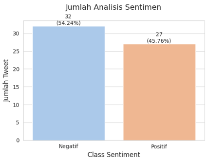
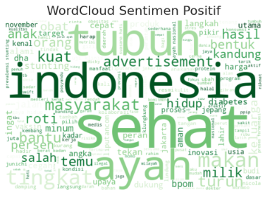
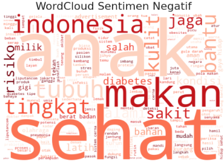
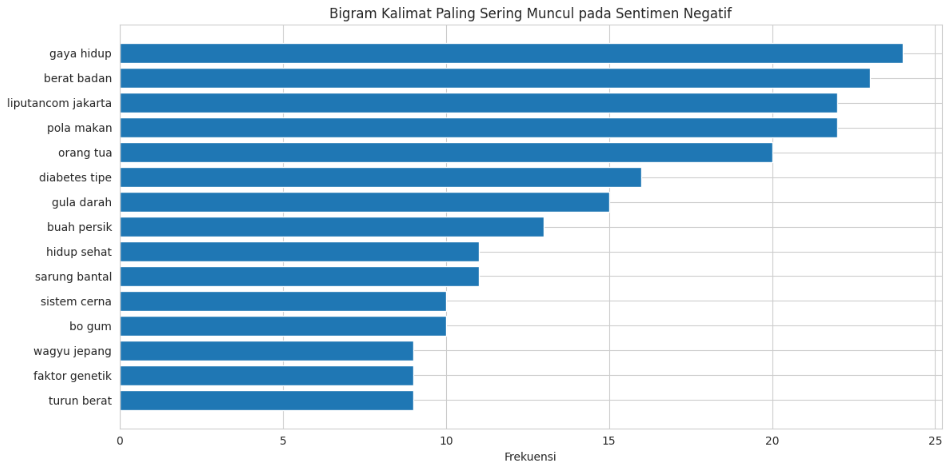
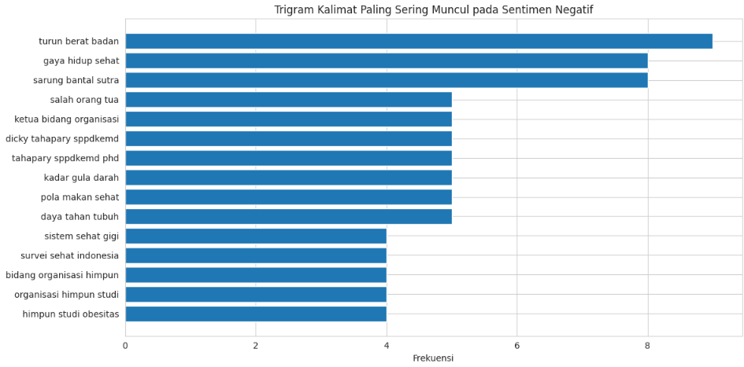

# 📰 Analisis Sentimen Berita Kesehatan Berbahasa Indonesia

Pipeline **Data Mining dan Natural Language Processing (NLP)** untuk mengumpulkan, membersihkan, dan menganalisis sentimen berita kesehatan berbahasa Indonesia menggunakan data hasil **web scraping dari Liputan6**.

---

## 📌 Ringkasan Proyek

Proyek ini membangun pipeline analisis teks dari tahap pengumpulan data hingga interpretasi hasil.

Data berita kesehatan dikumpulkan melalui **web scraping**, kemudian diproses melalui beberapa tahapan preprocessing, yaitu:

- Data cleaning
- Penghapusan data duplikat
- Case folding
- Normalisasi kata
- Tokenization
- Stopword removal
- Stemming

Setelah data siap dianalisis, digunakan pendekatan **lexicon-based sentiment analysis** untuk mengidentifikasi kecenderungan sentimen setiap artikel.

Hasil analisis kemudian divisualisasikan menggunakan distribusi sentimen, word cloud, serta analisis bigram dan trigram.

---

## 🎯 Tujuan

- Mengotomatisasi pengumpulan berita kesehatan melalui web scraping.
- Membersihkan dan menyiapkan data teks untuk analisis.
- Mengidentifikasi kecenderungan sentimen menggunakan pendekatan berbasis leksikon.
- Menemukan kata dan frasa yang dominan pada berita.
- Menyajikan hasil analisis dalam visualisasi yang mudah dipahami.

---

---

## 🌐 Data Collection

Data dikumpulkan dari halaman berita kesehatan **Liputan6** menggunakan teknik **web scraping**.

Informasi yang dikumpulkan meliputi:

- Judul artikel
- Tanggal publikasi
- Link artikel
- Ringkasan
- Isi artikel

### Dataset

| Informasi | Detail |
|---|---|
| Sumber | Liputan6 |
| Kategori | Health |
| Data awal | 5.000 artikel |
| Data akhir dianalisis | 59 artikel |
| Format | CSV |

---

## 🧹 Text Preprocessing

Data mentah diproses melalui beberapa tahapan sebelum digunakan dalam analisis sentimen:

- Data Cleaning
- Remove Duplicate Data
- Case Folding
- Word Normalization
- Tokenization
- Stopword Removal
- Stemming

---

## 🧠 Sentiment Analysis

Analisis sentimen dilakukan menggunakan pendekatan **Lexicon-Based Sentiment Analysis**.

Hasil analisis dikategorikan menjadi:

- **Positif**
- **Negatif**
- **Netral**

---

## 📊 Hasil Analisis

### Distribusi Sentimen



Hasil analisis menunjukkan bahwa sentimen negatif sedikit lebih dominan dibandingkan sentimen positif.

| Sentimen | Jumlah | Persentase |
|---|---:|---:|
| Negatif | 32 | 54,24% |
| Positif | 27 | 45,76% |
| Netral | 0 | 0% |
| **Total** | **59** | **100%** |

---

## ☁️ Word Cloud

### Sentimen Positif



Visualisasi ini menunjukkan kata-kata yang paling dominan pada artikel dengan sentimen positif.

### Sentimen Negatif



Visualisasi ini menunjukkan kata-kata yang paling dominan pada artikel dengan sentimen negatif.

---

## 🔗 Analisis Bigram & Trigram

### Bigram Sentimen Negatif



Bigram digunakan untuk melihat kombinasi **dua kata** yang paling sering muncul pada artikel dengan sentimen negatif.

### Trigram Sentimen Negatif



Trigram digunakan untuk melihat kombinasi **tiga kata** yang paling sering muncul dan memberikan konteks frasa yang lebih spesifik.

---

## 🔍 Insight Utama

Berdasarkan hasil eksplorasi:

- Sentimen negatif sedikit lebih dominan dibandingkan sentimen positif.
- Kata yang berkaitan dengan kesehatan, penyakit, makanan, tubuh, dan kondisi medis terlihat dominan.
- Word cloud memberikan gambaran mengenai kosakata utama pada masing-masing kelompok sentimen.
- Bigram dan trigram membantu mengidentifikasi pola frasa yang tidak terlihat hanya dari frekuensi kata tunggal.

---

## 🛠️ Teknologi & Library

| Teknologi / Library | Penggunaan |
|---|---|
| Python | Bahasa pemrograman |
| Google Colab | Environment pengembangan |
| Pandas | Pengolahan data |
| Requests | HTTP request & web scraping |
| BeautifulSoup | Parsing HTML |
| NLTK | Text preprocessing |
| NumPy | Komputasi numerik |
| Matplotlib | Visualisasi data |
| WordCloud | Visualisasi kata |

---

## 📁 Struktur Repository

```text
Indonesian-News-Sentiment-Analysis/
│
├── Images/
│   ├── sentiment_distribution.png
│   ├── wordcloud_positive.png
│   ├── wordcloud_negative.png
│   ├── bigram_negative.png
│   └── trigram_negative.png
│
├── Indonesian_News_Sentiment_Analysis.ipynb
└── README.md
